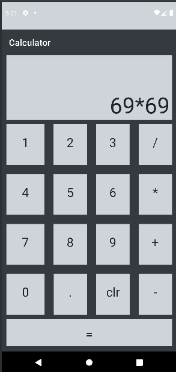
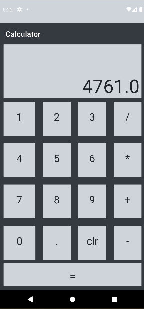

# Kotlin-Calculator

## Description

A calculator made in Kotlin, Android Studio, with basic arithmetic operation to learn about Kotlin and Android Studio

## Libs and Techniques

* [Kotlin](https://kotlinlang.org/)
* [Coolors](https://coolors.co) 
* [View Binding](https://developer.android.com/topic/libraries/view-binding)

## Screenshots

## Link to download APK file:
[here](https://drive.google.com/file/d/1xOj60KGhSqqmtpYLUDLi51Cs74zM7HBg/view?usp=sharing)
